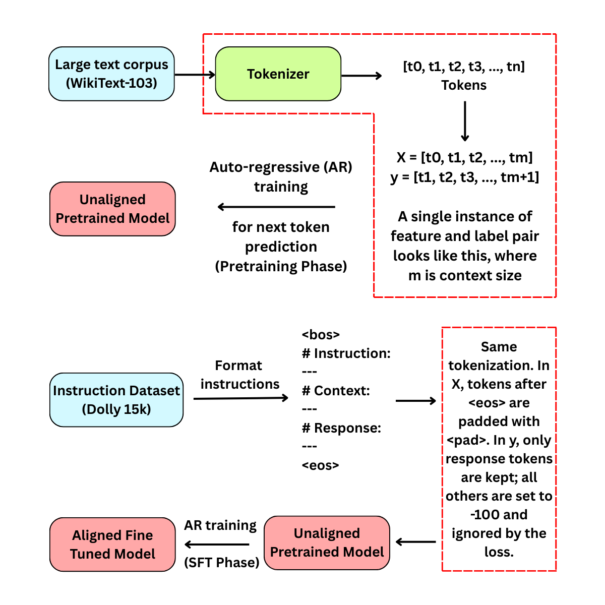
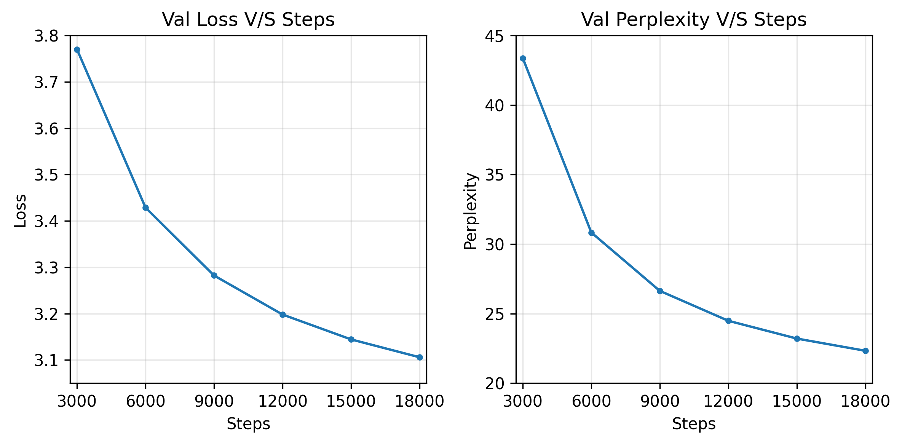

# AxiomLM-33M: Training a 33M Parameter Transformer Language Model From Scratch

A 33M-parameter decoder-only Transformer language model trained entirely from scratch on ~600M tokens, with experiments in supervised instruction fine-tuning and an analysis of alignment challenges in small language models.

---

# Project Overview

This project was built to **understand the full lifecycle of training a modern language model**.
Instead of using pretrained models, the goal was to reproduce the **entire LLM pipeline from scratch**, including tokenizer training, Transformer implementation, large-scale pretraining, and supervised instruction tuning.

The project was developed under **strict compute constraints (2× T4 GPUs on Kaggle)**, which required careful architectural design and training strategies.

During development I encountered several real-world issues that are common in LLM training:

* distribution mismatch between datasets
* catastrophic forgetting during fine-tuning
* capacity limits of small models
* instability in instruction alignment

Rather than hiding these problems, the repository documents them and analyzes **why they occur**, making the project both an engineering implementation and a learning experiment.

The result is a **fully functional 33M parameter language model** capable of generating coherent Wikipedia-style text and demonstrating the challenges of aligning small models with instruction-following behavior.

---

# Key Features

* Decoder-only Transformer implemented in **TensorFlow**
* Custom **SentencePiece tokenizer training**
* Distributed training using **TensorFlow strategy**
* Pretraining on **~600M tokens**
* Training pipeline inspired by modern LLM workflows
* Perplexity-based evaluation
* Supervised instruction fine-tuning experiment
* Failure analysis of **catastrophic forgetting**
* Investigation of **alignment challenges for small models**

---

# Model Architecture & Training Summary

| Category              | Value                                   |
| --------------------- | --------------------------------------- |
| Model Type            | Pre-Norm Decoder-only Transformer       |
| Tokenizer             | SentencePiece                           |
| Vocabulary Size       | 16k                                     |
| Encoding              | BPE                                     |
| Parameters            | ~33M                                    |
| Pretraining Time      | ~10 Hours                               |
| GPU                   | Kaggle – 2× NVIDIA T4 (32GB VRAM total) |
| Pretraining Dataset   | WikiText-103                            |
| Training Tokens       | ~600M                                   |
| Batch Size            | 64                                      |
| Transformer Blocks    | 8                                       |
| Attention Heads       | 8                                       |
| Context Length        | 512                                     |
| Embedding Size        | 512                                     |
| Optimizer             | AdamW                                   |
| LR Schedule           | Linear Warmup + Cosine Decay            |
| Peak LR               | 5e-4                                    |
| Final Test Perplexity | **22.48**                               |
| Fine-tuning Dataset   | Dolly-15k                               |

---

<p align="center">

<br>
<em>Figure 1: Pre-Norm Decoder-only Transformer architecture with next-token prediction objective.</em>
</p>

---

# Training Pipeline

<p align="center">

<br>
<em>Figure 2: Training pipeline used in this project.</em>
</p>

The model follows the typical two-stage LLM training process:

1. **Unsupervised Pretraining**
2. **Supervised Fine-Tuning (SFT)**

---

# 1. Pretraining

Pretraining teaches the model **general language structure** by predicting the next token in a sequence.

Large language models are typically pretrained on enormous corpora (often trillions of tokens). Due to compute limits, this project trained on **~600M tokens** from the WikiText-103 dataset.

Even at this scale, the model successfully learned:

* grammar
* sentence structure
* Wikipedia-style narrative patterns
* topic-based paragraph generation

The model was trained using the **autoregressive next-token prediction objective**, which is the same objective used by models like GPT.

---

# Autoregressive Training

Autoregressive (AR) training is the technique used to train language models to predict the **next token given all previous tokens**.

### How it works

1. The model receives a sequence of tokens:

```
The cat sat on the
```

2. It predicts the probability distribution for the next token:

```
mat
```

3. The model is optimized using **cross-entropy loss**, which penalizes incorrect predictions.

### Causal Masking

During training, a **causal attention mask** ensures the model can only see previous tokens and cannot access future tokens.

This prevents the model from "cheating" during training.

---

# 2. Supervised Fine-Tuning (SFT)

After pretraining, the model was fine-tuned to follow instructions using the **Dolly-15k instruction dataset**.

Instruction fine-tuning teaches the model to produce structured responses to prompts such as:

```
### Instruction:
When did Virgin Australia start operating?

### Context:
...

### Response:
...
```

### Training Setup

* Input format matched the Dolly dataset instruction structure
* The model was trained to **predict only the response tokens**
* Non-response tokens were masked with `-100` in the loss function

To preserve pretrained knowledge:

* the **embedding layer and first transformer layers were frozen**
* learning rate was reduced to **1e-5**
* weight decay was removed

These changes were intended to prevent large updates from destroying pretrained representations.

---

# Dataset

### Pretraining Dataset

**WikiText-103**

A language modeling dataset containing over 100M tokens from clean, long-form Wikipedia articles.
The dataset preserves natural article structure and long-range context.

[https://www.kaggle.com/datasets/vadimkurochkin/wikitext-103](https://www.kaggle.com/datasets/vadimkurochkin/wikitext-103)

---

### Instruction Fine-Tuning Dataset

**Dolly-15k**

An instruction dataset containing ~15k prompt–response pairs covering tasks such as:

* question answering
* summarization
* classification
* open-ended instructions

[https://www.kaggle.com/datasets/snehilsanyal/databricks-dolly-15k-dataset](https://www.kaggle.com/datasets/snehilsanyal/databricks-dolly-15k-dataset)

---

# Pretraining Results

| Metric                | Value     |
| --------------------- | --------- |
| Validation Loss       | 3.10      |
| Validation Perplexity | 22.32     |
| Test Loss             | 3.11      |
| Test Perplexity       | **22.48** |

---

<p align="center">

<br>
<em>Figure 3: Validation loss and perplexity during pretraining.</em>
</p>

The model learned to generate **coherent Wikipedia-style text**.
While generation quality is limited by the small model size, the outputs are grammatically correct and readable.

---

# Evaluation, Observations, and Failure Analysis

Model behavior was evaluated using:

* **Perplexity on WikiText-103**
* **Qualitative inspection of generated text**
* **Instruction-prompt experiments after SFT**

---

# Pretraining Behavior

The base model successfully learned the statistical structure of Wikipedia-style text.

Typical generated outputs resemble:

* topic descriptions
* historical paragraphs
* encyclopedia-like language

This indicates the model learned the **distribution of the training corpus** effectively.

---

# Effects of Supervised Fine-Tuning

Fine-tuning produced mixed results.

Two main behaviors were observed:

### 1. Partial Instruction Following

The model sometimes produced structured responses when prompted with the training format.

However, instruction-following behavior remained inconsistent.

---

### 2. Catastrophic Forgetting

After SFT, performance on the original language modeling task degraded.

Validation loss on the WikiText dataset increased significantly, indicating that the model **forgot part of its pretrained knowledge**.

This phenomenon is known as **catastrophic forgetting**.

---

# Distribution Mismatch

One major cause was the difference between the two datasets.

**Pretraining distribution**

```
Topic → Wikipedia paragraph
```

**Instruction tuning distribution**

```
Instruction → response
```

Because the model was trained almost entirely on encyclopedic text, adapting it to instruction-response patterns required large behavioral changes.

For a **small model (~33M parameters)** this transition is difficult.

---

# Model Size Constraints

Small language models have limited representational capacity.

They struggle to simultaneously maintain:

* fluent language modeling
* structured instruction responses
* task-specific reasoning

As a result:

* aggressive fine-tuning overwrote pretrained knowledge
* conservative fine-tuning produced minimal behavioral change

This tradeoff made stable alignment difficult.

---

# Limitations

Several factors limited the final model performance.

### Small Model Size

33M parameters restrict the model’s ability to represent complex behaviors.

Large capabilities such as reasoning and robust instruction following typically emerge in models with **hundreds of millions or billions of parameters**.

---

### Homogeneous Pretraining Corpus

WikiText-103 consists almost entirely of **encyclopedic text**.

It lacks:

* dialogue
* conversational data
* instruction-style text

This creates a large distribution gap with instruction datasets.

---

### Small Instruction Dataset

Dolly-15k contains only ~15k examples.

This is relatively small for aligning even small language models.

---

### Distribution Shift

The large difference between pretraining and SFT data made stable fine-tuning difficult.

---

### Compute Constraints

Training larger models or using significantly larger datasets was not feasible within the available hardware resources.

---

# Future Work

Several directions could significantly improve the model.

### Scaling the Model

Training models in the **500M–1B parameter range** would dramatically increase capacity for:

* instruction following
* reasoning
* multi-task behavior

---

### Mixed Pretraining Data

Including conversational or instruction-like text during pretraining could reduce the distribution gap between training stages.

---

### Larger Instruction Datasets

Using larger instruction datasets or synthetic instruction generation could improve alignment.

---

### Parameter-Efficient Fine-Tuning

Techniques such as **LoRA** could allow the model to adapt without overwriting pretrained knowledge.

---

### Knowledge Distillation

A small model could be trained to imitate a larger model to transfer stronger instruction-following behavior.

---

# Repository Structure

```
AxiomLM/
├── assets/
│   ├── architecture.png
│   ├── loss_ppl.png
│   └── training_pipeline.png
│
├── kaggle/
│
├── chat_test.ipynb
├── pretrain.ipynb
├── saving_data_npy.ipynb
├── sft_dataset.ipynb
├── supervised_finetuning.ipynb
├── text_generation.ipynb
├── tokenizer.ipynb
│
├── sample_generated_text.txt
├── pyproject.toml
├── .python-version
├── uv.lock
├── LICENSE
└── README.md
```

Some files used during training are not included in the repository because they are **very large**.

Additionally:

* Kaggle paths start with `/`
* local paths may differ

You may need to adjust file paths when running the notebooks locally.

---

# License

This project is released under the **MIT License**.

---

# References

* Vaswani et al. – *Attention Is All You Need*
* Kaplan et al. – *Scaling Laws for Neural Language Models*
* Hoffmann et al. – *Training Compute-Optimal Large Language Models (Chinchilla)*
* WikiText-103 Dataset
* Databricks Dolly-15k Dataset
