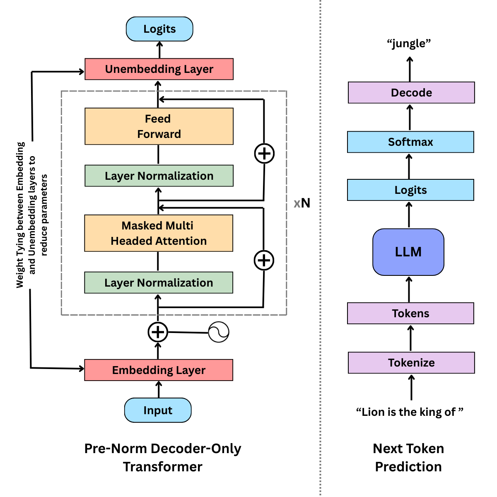

# AxiomLM-33M: Training a 33M Parameter Transformer Language Model from Scratch
A 33M parameter Transformer language model trained from scratch on 600M tokens, with experiments in supervised instruction fine-tuning and alignment challenges for small LLMs.

## Project Overview
This project implements a Transformer-based language model trained entirely from scratch.
The objective was to reproduce a simplified version of the modern LLM training pipeline,
including:
- Tokenizer training
- Transformer architecture implementation
- Language model pretraining
- Supervised instruction fine-tuning

The project focuses on understanding training dynamics,
scaling limitations, and the challenges of aligning small language models.

## Key Features
- Transformer language model implemented in TensorFlow
- Custom tokenizer training pipeline
- Distributed training support
- Pretraining on ~600M tokens (following the Chinchilla scaling laws)
- Perplexity-based evaluation
- Instruction fine-tuning experiment
- Analysis of catastrophic forgetting

## Model Architecture & Training Summary
| Category                    | Value                    |
| --------------------------- | ------------------------ |
| Model Type                  | Decoder-only Transformer |
| Tokenizer                   | SentencePiece, 16k vocab size, BPE encoding |
| Parameters                  | ~33M                     |
| Pretraining Time            | ~10 Hours                |
| GPU                         | Kaggle, 2x T4 GPUs, total 32 GB VRAM |
| Pretraining Dataset         | WikiText-103             |
| Training Tokens             | ~600M                    |
| Batch Size                  | 64                       |
| Transformer Blocks          | 8                        |
| Attention Heads             | 8                        |
| Context Length              | 512                      |
| Embedding Vector Size       | 512                      |
| Optimizer                   | AdamW                    |
| LR Schedule                 | Linear Warmup + Cosine Decay, $5\times10^{-4}$ (peak LR) |
| Final Test Perplexity       | 22.48                    |
| Fine-tuning Dataset         | Dolly 15k                |

### Architecture Diagram

<em>Figure 1: Pre-Norm Decoder-only Transformer architecture and next token prediction.</em>

## Training Pipeline
### 1. Pretraining
### 2. SFT

## Dataset

## Pretraining Results

## Supervised Fine-Tuning (SFT)

## Evaluation, Observations and Failure Analysis

## Limitations

## Future Work

## Repository Structure

## How to Run

## License

## References